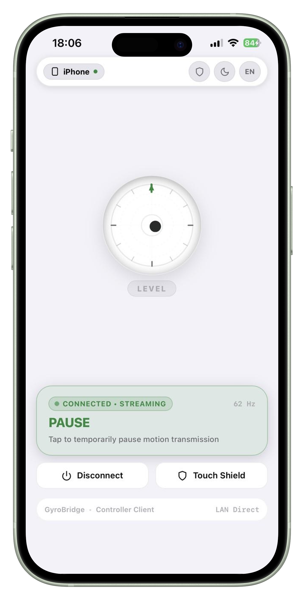
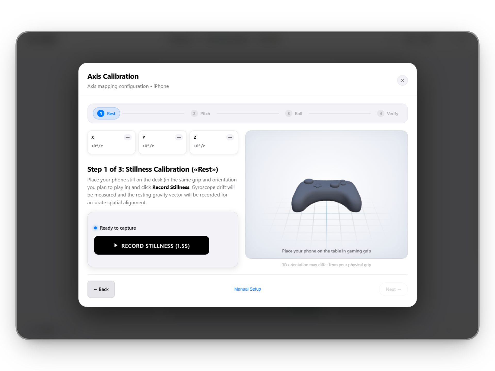
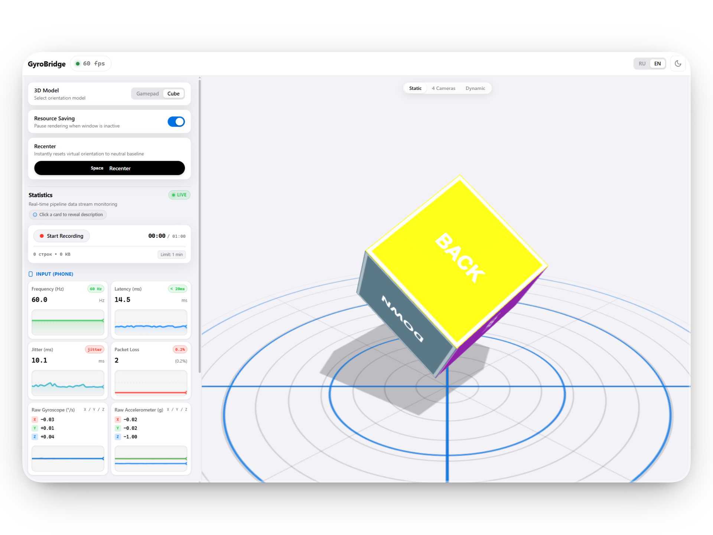
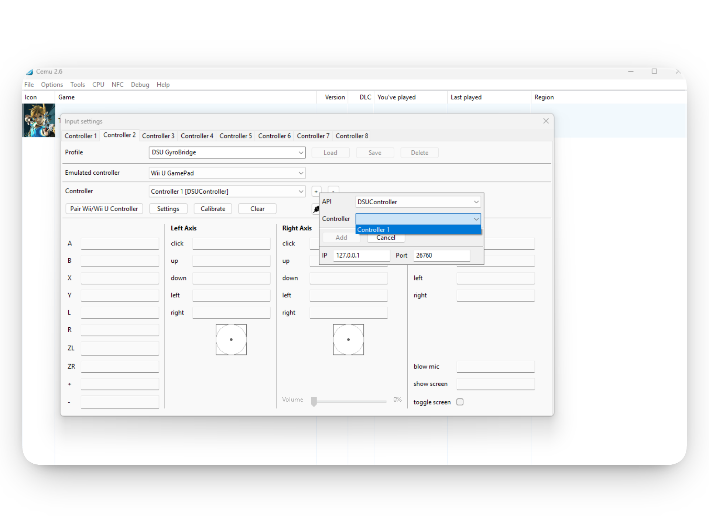

# Руководство пользователя GyroBridge

> **Важно:** Этот текст не стоит воспринимать за сухую и скучную документацию. Я крайне рекомендую прочитать его полностью, дабы избежать проблем и сэкономить кучу времени в будущем. **На это уйдёт буквально 5 минут!**

---

## Содержание

1. [Шаг 1. Скачивание и первичная настройка](#шаг-1-скачивание-и-первичная-настройка)
   - [Безопасность и антивирусы](#безопасность-и-антивирусы)
   - [Настройка смартфона: Android](#настройка-смартфона-android)
   - [Настройка смартфона: iOS (iPhone)](#настройка-смартфона-ios-iphone)
   - [Зачем вообще все эти действия с сертификатами?](#зачем-вообще-все-эти-действия-с-сертификатами)
2. [Шаг 2. Подключение смартфона и мобильный интерфейс](#шаг-2-подключение-смартфона-и-мобильный-интерфейс)
   - [Разбор элементов экрана телефона](#разбор-элементов-экрана-телефона)
   - [Кнопки Disconnect и SafeScreen (Защита экрана)](#кнопки-disconnect-и-safescreen-защита-экрана)
   - [Установка как Web App (PWA) и постоянный IP](#установка-как-web-app-pwa-и-постоянный-ip)
3. [Шаг 3. Профили, калибровка и центрирование](#шаг-3-профили-калибровка-и-центрирование)
   - [В чём смысл профилей?](#в-чём-смысл-профилей)
   - [Пошаговая калибровка](#пошаговая-калибровка)
   - [Калибровка vs Центрирование (Recenter): важное отличие](#калибровка-vs-центрирование-recenter-важное-отличие)
4. [Телеметрия и настройки на ПК](#телеметрия-и-настройки-на-пк)
5. [Подключение к эмулятору (на примере Cemu)](#подключение-к-эмулятору-на-примере-cemu)
6. [Известные проблемы и решения (Known Issues)](#известные-проблемы-и-решения-known-issues)
   - [Особенность Cemu: порядок запуска](#особенность-cemu-порядок-запуска)

---

## Шаг 1. Скачивание и первичная настройка

Скачайте последнюю версию приложения со страницы релизов:  
**[Скачать GyroBridge (GitHub Releases)](https://github.com/MrHoustonOff/iphone-gyro-controller/releases/latest)**

### Безопасность и антивирусы

Скорее всего, ваш антивирус или встроенный **Windows Defender (SmartScreen)** будет ругаться на скачанный `.exe` файл, а возможно, и вовсе молча заблокирует его. 

> [!NOTE]
> Я много раз писал о безопасности моего кода. **GyroBridge — это полностью открытый проект (Open Source).** Если у вас есть хоть капля сомнений:
> 
> 1. Вы можете лично открыть исходный код в репозитории и *прошерстить каждую строчку от и до*.
> 2. Собрать бинарник самостоятельно с нуля с помощью Go и Wails.
> 
> Если вы мне доверяете — просто достаньте файл из карантина антивируса и/или нажмите в окне Windows: <kbd>Подробнее</kbd> → <kbd>Выполнить в любом случае</kbd>.

При первом запуске на ПК нажмите кнопку <kbd>Initial Setup</kbd> (*Первичная настройка*). Откроется QR-код для установки защищённого локального канала связи между телефоном и компьютером.

---

### Настройка смартфона: Android

На Android всё максимально просто и не требует ковыряния в системных настройках:

1. Сканируйте камерой QR-код первого шага и перейдите по локальной ссылке `https://...`.
2. Chrome покажет стандартное предупреждение: *«Подключение не защищено»*.
3. Нажмите внизу: <kbd>Дополнительно</kbd> (или *«Подробнее»*) → <kbd>Перейти на сайт ... (небезопасно)</kbd>.
4. **Готово!** Браузер навсегда запомнит это исключение для вашего домашнего IP, и дальше страница будет открываться моментально в один клик.

---

### Настройка смартфона: iOS (iPhone)

Настройка под iOS детально описана **прямо в приложении** на ПК — во вкладке <kbd>Initial Setup</kbd> или в окне <kbd>Help</kbd> → *Initial Setup* (с пошаговыми иллюстрациями каждого шага в настройках iOS).

---

### Зачем вообще все эти действия с сертификатами?

> **Технический факт:**  
> Современные мобильные браузеры (особенно Safari на iOS и Chrome на Android) из соображений безопасности **намертво блокируют отдачу данных гироскопа и акселерометра по обычному незащищённому `http://` соединению**. 
> 
> Денег, возможностей и смысла покупать официальный публичный TLS-сертификат для домашней локальной сети нет. Это приложение **полностью локально и работает без интернета (100% Offline)**. 
> 
> Вы создаёте локальный сертификат безопасности (в случае с iPhone) или вручную подтверждаете доверие **СВОЕМУ ЛОКАЛЬНОМУ АДРЕСУ** (в случае с Android). Это абсолютно безопасно, исключает сторонние сервера и открывает доступ к гироскопу. **Именно благодаря этому решению вы можете использовать абсолютно любое устройство!**

---

## Шаг 2. Подключение смартфона и мобильный интерфейс

Теперь, когда ваше устройство доверяет вашему компьютеру, вы можете отсканировать **основной QR-код** на главном экране GyroBridge.

В браузере телефона откроется мобильное веб-приложение.

### Разбор элементов экрана телефона

* **Верхняя панель:** Быстрое переключение между светлой и тёмной темами оформления, а также смена языка интерфейса (<kbd>RU</kbd> / <kbd>EN</kbd>).
* **Разрешение датчиков (Motion Permission):**  
  Если вы зашли в первый раз или *«айфон решил сделать свои фирменные эппловские штучки-дрючки»* (сбросил разрешение во вкладке Safari) — на экране появится запрос доступа к движению. Просто нажмите большую кнопку <kbd>Разрешить доступ</kbd>.
* **Цифровой 2D-уровень (Level Indicator):**  
  Служит наглядным тестом: наклоните телефон в руках — пузырёк уровня должен плавно бегать по экрану. Если он двигается, значит датчики живы и отдают данные на частоте 60–120 Гц.
* **Интерактивная строка состояния (Status Pill):**  
  Отображает текущий статус соединения:
  - 🟡 **Connecting / Подключение...** — идёт рукопожатие и установка защищённого WSS-канала.
  - 🟢 **Streaming / Активно (XX Hz, X ms)** — датчики онлайн, телеметрия транслируется на ПК без задержек. **Нажатие на эту строку ставит передачу на паузу!**
  - ⏸️ **Paused / Пауза** — трансляция временно заморожена (удобно, если нужно отложить телефон, не разрывая соединение). Повторный клик мгновенно возобновляет стрим.
  - 🔴 **Disconnected / Отключено** — потеряна связь с сервером (убедитесь, что телефон и ПК подключены к одной сети Wi-Fi).

---

### Кнопки Disconnect и SafeScreen (Защита экрана)

В нижней части мобильного экрана расположены две ключевые кнопки управления:

1. **Disconnect (Отключиться):**  
   Принудительно разрывает текущую сессию передачи данных и мгновенно освобождает поток.

2. **SafeScreen (Защита экрана):**  
   
   > **Я КРАЙНЕ РЕКОМЕНДУЮ ВКЛЮЧАТЬ ЕГО ПОСТОЯННО ПЕРВЫМ ДЕЛОМ!**
   
   > [!IMPORTANT]
   > **Критически важная функция для длительных игровых сессий:**
   > 
   > - **Защита от выгорания и экономия батареи:** Переводит экран в абсолютно чёрный минималистичный режим (на OLED/AMOLED-дисплеях чёрные пиксели физически выключаются, сохраняя матрицу и заряд).
   > - **Блокировка засыпания (WakeLock):** SafeScreen **гарантированно запрещает экрану смартфона отключаться или уходить в сон** во время игры. Телефон будет непрерывно слать гироскоп столько часов, сколько длится ваша катка.

---

### Установка как Web App (PWA) и постоянный IP

Вы можете не сканировать камеру каждый раз, а просто сохранить сайт как полноценное приложение:

* **На iOS (Safari):** Нажмите кнопку *«Поделиться»* (квадрат со стрелкой вверх) → выберите <kbd>На экран "Домой"</kbd>.
* **На Android (Chrome):** Нажмите три точки в правом верхнем углу → выберите <kbd>Добавить на главный экран</kbd> (или *«Установить приложение»*).

> [!TIP]
> **Будет ли меняться IP-адрес?**  
> В большинстве домашних сетей Wi-Fi роутер закрепляет за компьютером постоянный локальный IP-адрес на недели вперёд (DHCP Lease). Поэтому сохранённая иконка на экране смартфона будет открывать стрим снова и снова. Сканировать QR повторно придётся только в том случае, если роутер назначит вашему ПК новый IP.

---

## Шаг 3. Профили, калибровка и центрирование

После первого подключения смартфона необходимо создать профиль ориентации и откалибровать устройство.

### В чём смысл профилей?

Каждый игрок держит контроллер по-своему: кто-то крепит смартфон горизонтально на клипсу геймпада сверху, кто-то кладёт его вертикально рядом, а кто-то держит телефон двумя руками как самостоятельный виртуальный руль.

**Профиль запоминает геометрию:** как именно ориентированы оси вашего смартфона относительно монитора. Вы можете создать профили под разные сценарии (например: *«Zelda (Клипса на геймпаде)»*, *«Гонки (Горизонтальный руль)»*).

### Пошаговая калибровка

Мастер калибровки на ПК проведёт вас через три простых и понятных действия:

1. **Этап 1: Покой (Zero-Bias)** — положите смартфон неподвижно в исходное игровое положение на 2–3 секунды. В этот момент GyroBridge замеряет тепловой шум сенсоров и полностью устраняет дрифт (*самопроизвольное сползание прицела*).
2. **Этап 2: Наклон вперёд (Pitch)** — плавно наклоните телефон от себя и верните назад. Алгоритм поймёт, какая ось отвечает за вертикальный прицел.
3. **Этап 3: Поворот вправо (Yaw / Roll)** — поверните устройство направо. Программа зафиксирует горизонтальную ось поворота.

---

### Калибровка vs Центрирование (Recenter): важное отличие

Здесь очень важно сделать паузу и раз и навсегда уяснить фундаментальную разницу:

> [!NOTE]
> **Эмуляторам (Cemu, Dolphin, Ryujinx) вообще не важен абсолютный угол наклона смартфона к горизонту!**  
> Играм важна исключительно **угловая скорость** вращения (насколько быстро и в какую сторону вы повернули руки прямо сейчас).
> 
> - **Калибровка** делается один раз: она обучает GyroBridge вашей персональной системе координат (где для вашей посадки находится *«вперёд»* и *«вправо»*).
> - **Центрирование (Recenter / Сбросить 3D-вид)** нужно **исключительно для вашего собственного визуального комфорта ВНУТРИ ДАННОГО ПРИЛОЖЕНИЯ**. Если 3D-моделька в окне ПК рассинхронизировалась с реальным телефоном на столе — просто положите руки удобно и нажмите Recenter.

---

## Телеметрия и настройки на ПК

* **Вкладка «Статистика» (Telemetry):**  
  Позволяет в реальном времени оценить качество связи: текущую частоту опроса (FPS), битрейт, сетевой пинг (в домашней Wi-Fi сети обычно стабильные **1–3 мс**), а также список подключённых клиентов эмулятора с указанием их точного IP и порта.
* **Вкладка «Настройки» (Settings):**  
  Управление портом DSU (`26760`), выбор сетевого интерфейса, поведение при закрытии окна (сворачивание в трей с ультранизким потреблением ОЗУ), переключение языка, а также **глобальная горячая клавиша центровки прицела** (по умолчанию `Ctrl+Shift+R`) с возможностью записи собственного сочетания клавиш в стиле Apple.

---

## Подключение к эмулятору (на примере Cemu)

GyroBridge работает по стандартному сетевому протоколу **Cemuhook DSU (UDP)**. Для эмулятора ваш телефон выглядит как настоящий геймпад с полноценным 6-осевым гироскопом.

### Пошаговая настройка в Cemu 2.0+

1. Откройте Cemu → меню <kbd>Опции</kbd> → <kbd>Настройки управления</kbd> (*Options → Input Settings*).
2. Выберите вкладку **Контроллер 1** (или тот слот, на котором вы играете).
3. **Эмулируемый контроллер:** обязательно выберите **Wii U GamePad**.
   
   > [!WARNING]
   > **НЕ выбирайте Wii U Pro Controller!** В оригинальной консоли Wii U контроллер Pro Controller физически **не имел гироскопа**. В таких играх, как *The Legend of Zelda: Breath of the Wild*, гироскоп для прицеливания и святилищ-головоломок игра принимает **исключительно от Wii U GamePad**!
4. **Контроллер (источник ввода):**
   - Нажмите кнопку **`+`** рядом со списком контроллеров.
   - В выпадающем списке **API** выберите **`DSUClient`** (или `DSUController`).
   - Убедитесь, что указан IP `127.0.0.1` и порт `26760`.
   - В списке найденных устройств выберите `Controller 1` и нажмите <kbd>Add (Добавить)</kbd>.
5. Выберите добавленный `Controller 1 [DSUController]`, нажмите кнопку <kbd>Настройки</kbd> под ним и убедитесь, что включена галочка **«Использовать гироскоп / Use motion»**.
6. Нажмите <kbd>Сохранить</kbd> профиль.

---

## Известные проблемы и решения (Known Issues)

### Особенность Cemu: порядок запуска

Если вы запустили эмулятор Cemu **ДО** того, как включили GyroBridge:

- Cemu при своём старте отправляет пробный сетевой пакет на порт `127.0.0.1:26760`.
- Поскольку GyroBridge **в этот момент был ещё выключен**, сетевой стек Windows возвращает статус *«порт недоступен»*.
- В Cemu (из-за отсутствия встроенного фонового таймера повторных попыток) поток сетевого сокета **засыпает**. При этом в интерфейсе Cemu значок штекера может светиться как подключённый, но гироскоп в игре молчит, а GyroBridge показывает статус: *«Ожидание эмуляторов»*.

### Решения:

* **Способ 1 (Рекомендуемый и самый беспроблемный):**  
  Всегда запускайте **GyroBridge ДО запуска Cemu** (или держите GyroBridge свёрнутым в трее при старте Windows — он потребляет меньше 20 МБ памяти и 0% процессора).
* **Способ 2 (На лету прямо во время игры):**  
  Если игра уже идёт, и вы не хотите её закрывать:
  1. В Cemu откройте меню <kbd>Опции</kbd> → <kbd>Настройки управления</kbd>.
  2. В строке контроллера нажмите **`-`** (удалить DSU-контроллер) и сразу же **`+`** (добавить заново: `DSUClient` → `Controller 1`).
  3. Это принудительно разбудит сетевой стек Cemu, и данные гироскопа подхватятся моментально без перезапуска игры!
